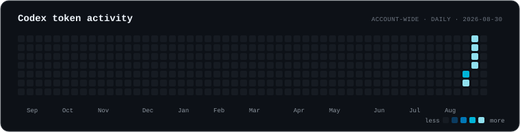
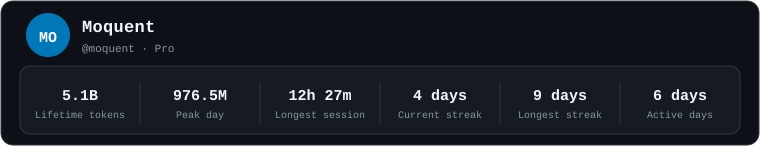
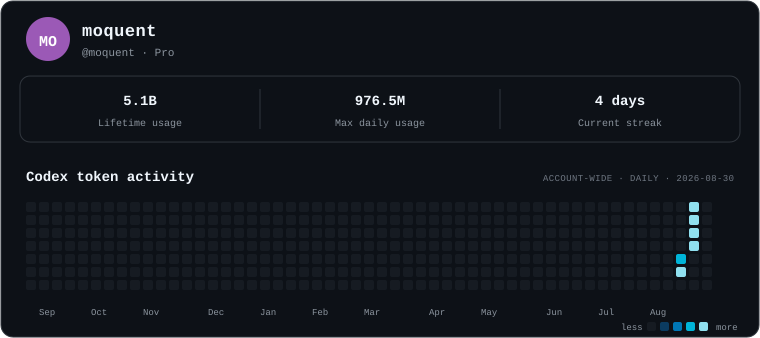

# AI Usage Profile

Put your **account-wide AI usage** on your GitHub profile — like a contribution graph, but for Codex (and more providers later).

One command on your laptop. One image in your README. Done.

## Quick start

You need **Node 22.13+** and **Codex signed in** on that machine (`codex login`).

```bash
npx ai-usage-profile setup
```

No OAuth signup required — the CLI includes a public GitHub OAuth client id for device login. Override with `AI_USAGE_GITHUB_CLIENT_ID` if you use your own OAuth App.

**From source** (same repo, useful for development):

```bash
git clone https://github.com/Moquent/ai-usage-profile.git
cd ai-usage-profile
corepack pnpm install   # or: npx pnpm@11.24.0 install
node packages/client/bin/ai-usage-profile.js setup
```

That’s it. `setup` will:

1. Check Codex is logged in
2. Ask you to approve GitHub in the browser (device login — empty scopes)
3. Publish your usage snapshot to the hosted origin
4. Print a README snippet to paste into your profile
5. Install a background schedule (LaunchAgent on macOS) — runs on login and about every 2 hours while your laptop is awake

Already set up once? Push fresh stats anytime:

```bash
npx ai-usage-profile publish
```

From source: `node packages/client/bin/ai-usage-profile.js publish`

Default origin: `https://aiusage.teje.sh` (override with `AI_USAGE_ENDPOINT`).

### GitHub OAuth App (optional)

The CLI ships with a built-in OAuth App client id for device login. To use your own app instead:

GitHub → **Settings → Developer settings → OAuth Apps → New OAuth App**

- Homepage: `https://aiusage.teje.sh` (or yours)
- Callback: `https://github.com/login/oauth/callback`
- **Enable Device Flow:** on
- **Expire user access tokens:** off (scheduled publish uses a long-lived token)

Copy the **Client ID** into `AI_USAGE_GITHUB_CLIENT_ID`. No client secret needed for device login.

**Shortcut:** `GITHUB_TOKEN` or `AI_USAGE_GITHUB_TOKEN` skips device login entirely.

## Paste into your README

Run `setup` — it prints a GitHub-safe `<picture>` snippet with encoded query params. Or paste this (replace `your-login`):

```html
<picture>
  <source media="(prefers-color-scheme: dark)"
          srcset="https://aiusage.teje.sh/u/your-login/card.svg?theme=dark&amp;layout=profile&amp;identity=show&amp;stats=lifetime%2Cpeak%2Clongest-chat%2Ccurrent-streak%2Clongest-streak%2Cactive-days">
  <source media="(prefers-color-scheme: light)"
          srcset="https://aiusage.teje.sh/u/your-login/card.svg?theme=light&amp;layout=profile&amp;identity=show&amp;stats=lifetime%2Cpeak%2Clongest-chat%2Ccurrent-streak%2Clongest-streak%2Cactive-days">
  
</picture>
```

Replace `your-login` with your GitHub username. Your repo layout doesn’t matter — profile README, `username/username`, whatever.

## What it looks like

Examples below use sample data (dark theme). Your card uses **your** real stats.

**Graph** — contribution-style daily tokens:



**Stats** — pick the numbers you care about:



**Profile** — identity + stats + graph:



## Customize the card

Tweak the image URL with query params (no files in git):

```text
?theme=dark|light
?layout=graph|stats|profile
?stats=lifetime,peak,current-streak,longest-streak,active-days,...
?identity=show|hide
```

Examples:

```text
# Just a heatmap
.../card.svg?theme=dark&layout=graph&identity=hide

# Six stats, light mode
.../card.svg?theme=light&layout=stats&stats=lifetime,peak,longest-chat,current-streak,longest-streak,active-days

# Profile card (default from setup; in HTML use &amp; and %2C like the snippet above)
.../card.svg?theme=dark&layout=profile&identity=show&stats=lifetime,peak,longest-chat,current-streak,longest-streak,active-days
```

| Layout | What you get |
| --- | --- |
| `graph` | Daily token heatmap |
| `stats` | Up to 6 stat tiles |
| `profile` | Name + stats + activity graph |

Stats include lifetime tokens, peak day, streaks, longest session, active days, and more. Missing data shows an em dash — no fake numbers.

## Your data stays yours

We tried to make this boringly safe:

- **Usage is read on your machine** via the Codex app server (`account/usage/read`). Your OpenAI / ChatGPT login **never** touches our server.
- We only receive a **small JSON summary**: daily token totals and aggregate metrics. **No prompts, no code, no conversations.**
- **GitHub:** on each publish, your laptop sends a bearer token so we can call `api.github.com/user` and bind the card to **your** login. We **do not store** that GitHub token.
- The card URL is public (it’s on your profile). The snapshot is usage stats, not chat content.

If that’s still too hosted for you — **run your own origin**. This repo includes the API (`packages/server`), schemas, and renderer. Point the CLI at your instance with `AI_USAGE_ENDPOINT`.

## For developers

Monorepo: `packages/shared`, `packages/client` (CLI), `packages/server` (API).

```bash
pnpm install
pnpm check
```

More detail: [`packages/client/README.md`](packages/client/README.md).

### Publish to npm

Login once, then publish both packages (shared first, then CLI):

```bash
npm login
corepack pnpm install
corepack pnpm publish:npm
```

Or publish each package manually:

```bash
corepack pnpm --filter @ai-usage-profile/shared publish --access public
corepack pnpm --filter ai-usage-profile publish --access public
```

Do **not** run `npm publish` from the monorepo root (it is `private`).

## Legal

- **Software license:** [MIT](LICENSE) (open-source code)
- **Hosted service:** [Terms of Service](legal/TERMS.md) · [Privacy Policy](legal/PRIVACY.md)
- Live: `https://aiusage.teje.sh/terms` and `https://aiusage.teje.sh/privacy`

MIT licensed.
